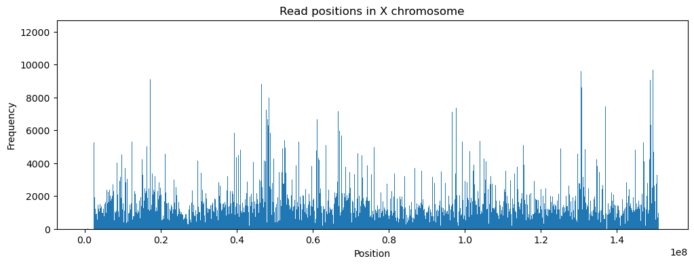
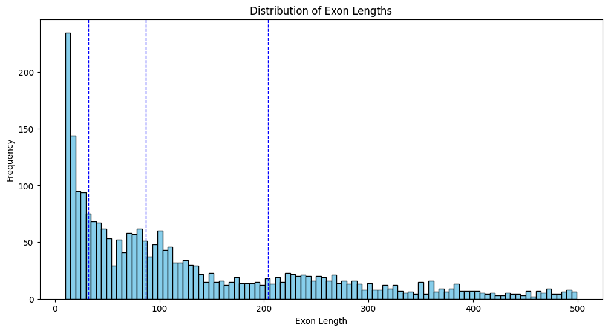

# Genomics
## Overview

This project specializes in the comprehensive analysis of the X chromosome. By leveraging a reference sequence, the Burrows-Wheeler Transform (BWT) of that sequence, and multiple reads, our code precisely aligns the reads to the optimal positions within the reference sequence. Following alignment, the project conducts an in-depth analysis to make sense of the data and provide valuable insights.

## Features

- Reference sequence alignment
- Burrows-Wheeler Transform (BWT) processing
- Read fitting and matching
- Post-fitting analysis

## Installation

To install the necessary dependencies, run:

```bash
pip install -r requirements.txt
```

## Usage

To run the analysis. Add your data in `gene_data` and use the following command:

```bash
python3 main.py --bwt gene_data/chrX_last_col.txt --map gene_data/chrX_map.txt --ref gene_data/chrX.fa --reads gene_data/reads --err_thresh 2 --save_path ../results.csv
```

A C++ version of the code is also available. To run the C++ version, first compile the code using the following command:

```bash
g++ -fopenmp -o main_cpp main_cpp.cpp
```

Then run the compiled code using:

```bash
./main_cpp gene_data/chrX_last_col.txt gene_data/chrX_map.txt gene_data/chrX.fa gene_data/reads
```

## Results

Distribution of starting points of matched reads vs position:


Frequency of matches at a given position vs position in the reference sequence:



Coverage region of reads:


Coverage region of exons:


Positions of error (mismatch or insertion/deletion) vs position in the reference sequence:


Position of only mismatches vs position in the reference sequence:


Exon lengths:



Error distribution:


## Inference

- Highest number of mismatches per read occurred in bins labelled 3008 and 3132, corresponding to locations between 46 million and 48 million base pairs in the X chromosome, which lies on the band Xp11.3.

Bands on X chromosome with above region highlighted. (Source : Wikipedia)

- Few important genes on this band are MAOA, MAOB, EFHC2, NDP and CDK16
- NDP is responsible for encoding Norrin protein, responsible for retinal development. Mismatches here signal towards potentially abnormal development of the retina, which may even lead to blindness.​
- CDK16 is responsible for encoding PCTAIRE-1 enzyme, responsible for autophagy and decrease in cancer cell proliferation. Abnormailities in this gene have been shown to increase occurrences of skin, lung, breast, prostateand many other cancers.
